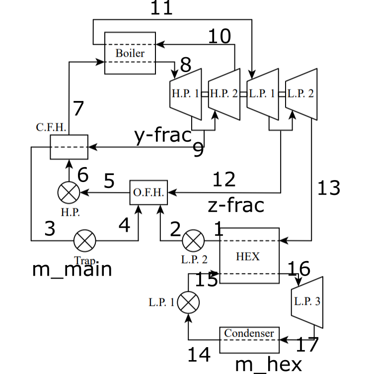

# thermo_project

Summer 2020 Rankine Cycle Analysis Thermodynamics Project

Shane Riley and Gabe Vogel

## Timeline

Attempt to have EES model working by 7/27, and report done by 8/1.

## Primary Action Items

- Build EES script
- Add Parameterized modeling into EES/Identify input space
- Find best scenario
- Make figures for report
- Write report

## EES model

I assigned state numbers arbitrarily, as well as mass-flow diversion factors. See labels.png

Note: Here is what I mean by mass fractions:
m_main = y + z + (main flow)
The main flow (not CFH or OFH) is (1 - y - z)
